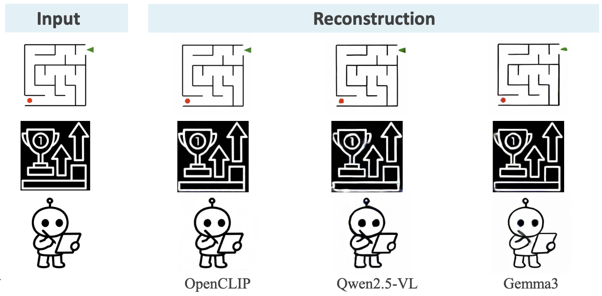

# ✨✨  *Latent Sketchpad*: Sketching Visual Thoughts to Elicit Multimodal Reasoning in MLLMs


[](https://hwanyu112.github.io/Latent-Sketchpad/)
[](https://arxiv.org/abs/2501.01234)
[](LICENSE)
[](https://github.com/hwanyu112/Latent-Sketchpad/stargazers)  


<font size=7><div align='center' > [[🍎 Project Page](https://latent-sketchpad.github.io/)] [[📖 arXiv Paper](https://arxiv.org/abs/2408.13257)] [[🤗 Sketch Decoder · Checkpoint](https://huggingface.co/huanyu112/Latent-Sketchpad.Sketch_Decoder)] [[🤗 Dataset · Coming soon]()]  </div></font>


---

## 🔥 News
* **`2025.10.29`** 🚀 Our paper **Latent Sketchpad: Sketching Visual Thoughts to Elicit Multimodal Reasoning in MLLMs** is now available on [arXiv](https://arxiv.org/abs/2501.xxxxx) together with the [code release](https://github.com/hwanyu112/Latent-Sketchpad). Latent Sketchpad ***extends frontier MLLMs (e.g., Gemma3 and Qwen2.5-VL) to interleave text and visual latents generation***, incorporating visual thoughts directly into reasoning.


## 👀 Contents

- [Latent Sketchpad Overview](#latent-sketchpad-overview)
- [Usage Guide](#usage-guide)
- [Sketch Decoder](#sketch-decoder)
- [Dataset](#dataset)
- [Experimental Results](#experimental-results)
- [Citation](#citation)
- [Related Works](#related-works)


## Latent Sketchpad Overview

<p align="center">
    
</p>

Multimodal Large Language Models (MLLMs) excel at **visual understanding**, but they face key limitations:  
- ❌ They struggle in **complex scenarios requiring visual planning and imagination**.  
- ❌ Their **internal visual representations** are used only for perception, not for **generative reasoning**.  

### 🌟 **Latent Sketchpad**

Latent Sketchpad extends frontier MLLMs (e.g., **Gemma3**, **Qwen2.5-VL**) with an **internal visual scratchpad**, enabling models to interleave **textual reasoning** and **visual latent generation** within the autoregressive process.  

### 🔑 Key Components 
- **✏️ Context-Aware Vision Head** – Generates **context-aware visual latents** from the MLLM’s hidden states, reflecting the model’s evolving “mental images”.  
- **🎨 Pretrained Sketch Decoder** – Translates these visual latents into **sketch-style images**, providing human-interpretable inspection of the model’s internal reasoning.  

### 💡 Key Features
- 🚀 Extends frontier MLLMs (e.g., **Gemma3**, **Qwen2.5-VL**) with the ability to perform **visual thinking** alongside text.  
- ✏️ Produces **sketch-style visualizations** of internal reasoning, enhancing **interpretability**.  
- 🔍 Validated on the new **MazePlanning** dataset and across different MLLMs, demonstrating **plug-and-play modularity** and **broad applicability**.


## Usage Guide

### 🔧 Installation
```bash
# Clone this repository
git clone https://github.com/hwanyu112/Latent-Sketchpad.git
cd Latent-Sketchpad

# (Optional) Create and activate a virtual environment
conda create -n sketchpad python=3.10 -y
conda activate sketchpad

# Install dependencies
# Note: Please select the appropriate file according to the model you plan to use.
# Gemma3
bash scripts/setup_gemma.sh

# or Qwen2.5-VL
# bash scripts/setup_qwen.sh
```

---

### 🏋️ Training

We provide training scripts for different backbone MLLMs (e.g., Qwen2.5-VL, Gemma3).  
Please make sure to first configure the environment according to [Installation](#installation).

Before running any training script, **ensure that all parameter settings in the script are correctly configured** according to your experimental setup (e.g., dataset paths, model names, and checkpoints).

To enable language-output-only pretrained MLLMs to interleave text and visual generatrion, the training process is divided into **two stages**:

- **Stage 1** (`training_stage1.sh`)  
  Downstream task fine-tuning.  
  

  ```bash
  # Stage 1 Training
  bash scripts/training_stage1.sh
  ```

- **Stage 2** (`training_stage2.sh`)  
  Vision Head training 
  

  ```bash
  # Stage 2 Training
  bash scripts/training_stage2.sh
  ```

---

### 📊 Evaluation
We provide evaluation scripts to test Latent Sketchpad on our MazePlanning dataset.

```bash
# Evaluate a trained checkpoint on MazePlanning dataset
export GENERATION_TYPE=multimodal # replace with 'text_only' for text-only generation
python evaluate.py --model_path /path/to/model \
                --decoder_path /path/to/sketch_decoder.ckpt  \
                --data_path /path/to/test_data.json \
                --image_folder imgs/ \
                --output_dir /path/to/output_dir
```

We also provide an inference script.

```bash
export GENERATION_TYPE=multimodal # replace with 'text_only' for text-only generation
python inference.py --model_path /path/to/model \
                --decoder_path /path/to/sketch_decoder.ckpt  \
                --data_path /path/to/test_data.json \
                --image_folder imgs/ \
                --output_dir /path/to/output_dir
```

## Sketch Decoder

<!-- The **Sketch Decoder** is an independent module designed to visualize the internal visual latents produced by the Vision Head.  
It operates separately from the backbone MLLM, and can be used to **translate latent features into human-interpretable sketch-style images**.  
This improves transparency of the reasoning process and facilitates inspection. -->

---

### ⚙️ Environment Setup

Install dependencies for the Sketch Decoder separately (to avoid conflicts with the MLLM environment):

```bash
# Install dependencies
bash decoder/setup.sh
```

---

### 🏋️ Training
We provide training scripts for pretraining the **Sketch Decoder**.  
Before launching the training, please refer to the configuration file  
[`decoder/configs/vit-only-gemma3-12-224-40G.json`](decoder/configs/vit-only-gemma3-12-224-40G.json)  
and adjust the settings as needed.

In particular:
- `"number_per_class": -1`  (control the number of samples from each class)
- `"cate_num": -1`  (control the number of classes)
 
The default value `-1` means that **all available samples** from the **[QuickDraw](https://github.com/googlecreativelab/quickdraw-dataset)** dataset will be used for training.

If you plan to train the **Sketch Decoder** with a vision encoder other than **OpenCLIP**, **Gemma3**, or **Qwen2.5-VL**,  
please modify the implementation in [`decoder/vision_encoder_wrapper.py`](decoder/vision_encoder_wrapper.py)  
and update the corresponding `"input_dim"` field in the configuration file to match the feature dimension of your chosen encoder.

After configuring the file, run the following commands to start training:

```bash
# Train the Sketch Decoder from scratch
cd decoder/
bash run.sh
```

---

### 🚀 Pretrained Checkpoint and Image Reconstruction Demo
We provide pretrained **Sketch Decoder** weights on Hugging Face — you are welcome to download them before running the demo:

👉 [Pretrained Sketch Decoder](https://huggingface.co/huanyu112/Latent-Sketchpad.Sketch_Decoder)

The repository includes pretrained checkpoints corresponding to three different vision encoders from:
- **OpenCLIP/ViT-L-14**
- **Gemma3-12B**
- **Qwen2.5-VL-7B**


You can then launch the demo script to visualize the pretrained Sketch Decoder reconstruction pipeline:
```bash
python sketch_decoder/app.py \
  --vision_model "google/gemma-3-12b-it" \
  --checkpoint_path "path/to/decoder" \
  --feature_dim 1152  
```
You can select the appropriate checkpoint for your chosen vision model and specify it via `--checkpoint_path`.
The `--feature_dim` should match the output dimension of the corresponding vision encoder (e.g., Gemma3: 1152, OpenCLIP: 1024, Qwen2.5-VL: 1280).

The demo works as follows:
-	The input image is first encoded into a visual representation using a selected vision encoder (OpenCLIP, Qwen2.5-VL, or Gemma3).
-	The Sketch Decoder then reconstructs this latent representation into a sketch-style image.

#### 🎨 Reconstruction Examples

Below we show the reconstruction results of the same input image using different vision encoders.  

<p align="center">
  
</p>

These results highlight that the **pretrained Sketch Decoder** not only ensures **broad compatibility across diverse vision encoders**, but also demonstrates strong **generalization**.

## 🚀 Running GPT-4o + Latent Sketchpad
We provide the script 4o_ls.py for running the GPT-4o + Latent Sketchpad setup.
You can execute it directly using:
```bash
export GENERATION_TYPE=agent
export OPENAI_API_KEY=YOUR_API_KEY
python 4o_ls.py --model_path /path/to/latent_sketchpad \
                --decoder_path /path/to/sketch_decoder_qwen25_vl.ckpt  \
                --data_path /path/to/data.json \
                --image_folder ls_imgs/ \
                --output_dir /path/to/output
```

## Dataset

The **MazePlanning** dataset is specifically designed to evaluate interleaved multimodal reasoning.  
It provides **complex mazes paired with step-by-step interleaved text-and-image reasoning sequences**, allowing models to demonstrate planning and imagination beyond static perception.

- **Training Set**:  
  - 47.8K unique mazes of varying grid sizes (from 3×5 to 5×5).  
  - Each maze is accompanied by detailed reasoning trajectories with interleaved text and visual states.  

- **Evaluation Sets**:  
  1. **In-Distribution (ID) Test Set**:  
     - 500 mazes sampled from the same size distribution as the training data.  
     - Evaluates performance under familiar conditions.  
  2. **Out-of-Distribution (OOD) Test Set**:  
     - 200 larger mazes with a fixed 6×6 grid configuration.  
     - Designed to assess **generalization to more complex unseen scenarios**.

---

📢 **Availability**:  
The dataset is **coming soon**. Stay tuned for the official release! 🚀


## Experimental Results

Latent Sketchpad enables **different MLLMs** to perform **interleaved text-and-visual reasoning**, extending their capabilities beyond text-only deliberation.

- We demonstrate **visual thought generation** on frontier MLLMs such as **Qwen2.5-VL** and **Gemma3**.  
- The framework equips these models with the ability to **produce internal visual latents** during reasoning, which are then visualized into sketches for interpretability.  
- Our results highlight **consistent generalization across models**, showing that Latent Sketchpad is not tied to a specific backbone.  

<p align="center">
  
</p>

👉 For **full multimodal showcase videos** with interleaved reasoning, please visit our [🌐 project page](https://latent-sketchpad.github.io/).


## Citation

If you find our work helpful for your research, please consider citing our work.   

```bibtex
 @article{zhang2025latentsketchpad,
          title={Latent Sketchpad: Sketching Visual Thoughts to Elicit Multimodal Reasoning in MLLMs},
          author={Zhang, Huanyu and Wu, Wenshan and Li, Chengzu and Shang, Ning and Xia, Yan and Huang, Yangyu and Zhang, Yifan and Dong, Li and Zhang, Zhang and Wang, Liang and Tan, Tieniu and Wei, Furu},
          journal={arXiv preprint arXiv:2510.24514},
          year={2025}
        }
```

## Related Works

Explore our related researches:
- **[MVoT · ICML 2025]** [Imagine while Reasoning in Space: Multimodal Visualization-of-Thought](https://arxiv.org/pdf/2501.07542)
- **[VoT · NeuralPS 2024]** [Mind's Eye of LLMs: Visualization-of-Thought Elicits Spatial Reasoning in Large Language Models](https://proceedings.neurips.cc/paper_files/paper/2024/file/a45296e83b19f656392e0130d9e53cb1-Paper-Conference.pdf)


